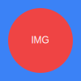

# Testing Nested Images

This post demonstrates loading an image from an `./images/` subdirectory.

## inline html pic
**测试一下 (Quoted - Recommended):**

**测试一下 (Unquoted - Testing):**

**Simple Unquoted:**

### Note on HTML Attributes
HTML5 allows omitting quotes for simple values. This should work.
