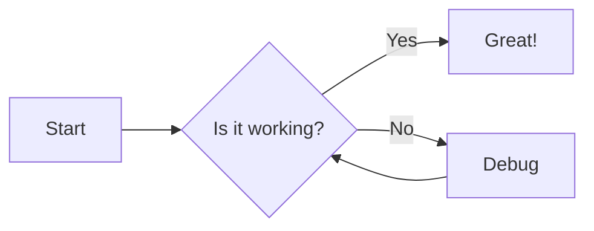
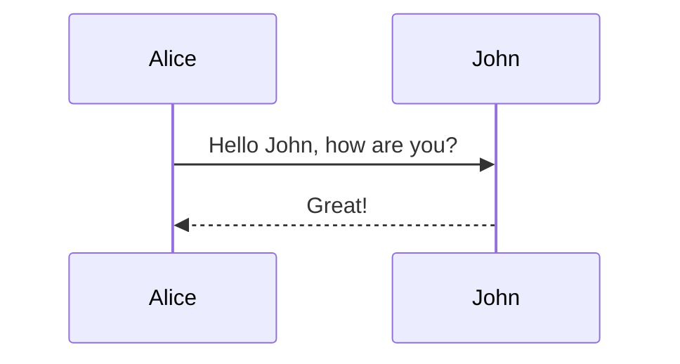

# Heading Level 1

This is a paragraph under H1. **Bold text**, *italic text*, and ~~strikethrough~~.

## Heading Level 2

Here is a blockquote:

Hello world

Hello

> "The digital garden is not just a collection of posts, but a web of interconnected thoughts."
>
> — Unknown Gardener

> test quote
>
> hello world

### Heading Level 3

#### Heading Level 4

##### Heading Level 5

###### Heading Level 6

hello

###### hello

What

---

## Lists

### Unordered

- Item 1
- Item 2
  - Nested Item 2.1
  - Nested Item 2.2
- Item 3

### Ordered

1. Step One
2. Step Two
3. Step Three

### Task List

- [x] Implement Markdown

- [ ] Add Syntax Highlighting

- [ ] Write Documentation

- [ ] hello

- [ ] world

- [ ] what

- \[ \] why
- \[ \]

- [ ] hello

- [ ] Ok

- [ ] Hey

---

## Code

### Inline

The `useState` hook is essential. You can install via `bun install`.

### Code Blocks

**TypeScript:**

```typescript
interface User { googd
  id: number;
  name: string;
}

function getUser(id: number): User {
  return { id, name: "Alice" };
}
```

**Bash:**

```bash
echo "Hello World" > hello.txt
ls -la
```

**JSON:**

```json
{
  "project": "Amytis",
  "version": "1.4.0"
}
```

---

## Math (LaTeX)

Inline math: $E = mc^2$ and $e^{iπ} + 1 = 0$.

Block math:

$$ \\frac{1}{\\sigma\\sqrt{2\\pi}} \\exp\\left( -\\frac{1}{2} \\left( \\frac{x-\\mu}{\\sigma} \\right)^2 \\right) $$

---

## Diagrams (Mermaid)

### Flowchart



### Sequence Diagram



---

## Images

### Standard Markdown


### Raw HTML (Quoted)


### Photos from Public Directory


### Vibrant Waves (JPG format)


### Side by Side (Raw HTML)


---

## Tables

FeatureStatusNotes**GFM**✅Tables supported**Math**✅KaTeX integration**Mermaid**✅Native rendering

---

## Links

[hello](https://hutusi.com)

- [Internal Link to Home](/)
- [External Link (Google)](https://google.com)
- [Reference Link](https://github.com/vercel/next.js)

---

## HTML Components

Click to expand secret info

This content is inside a raw HTML `details` tag with inline styles.

---

## Footnotes

Here is a footnote reference\[^1\]. And another one\[^note2\].

\[^1\]: This is the first footnote text. \[^note2\]: This is a second footnote with **bold** text.